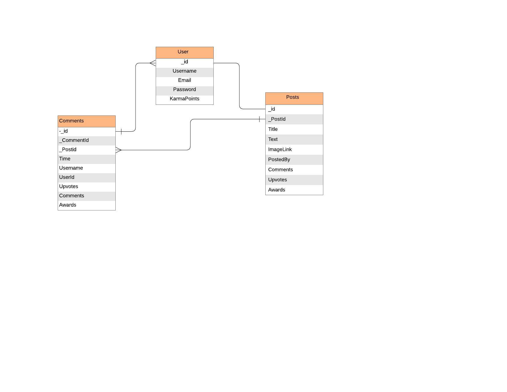
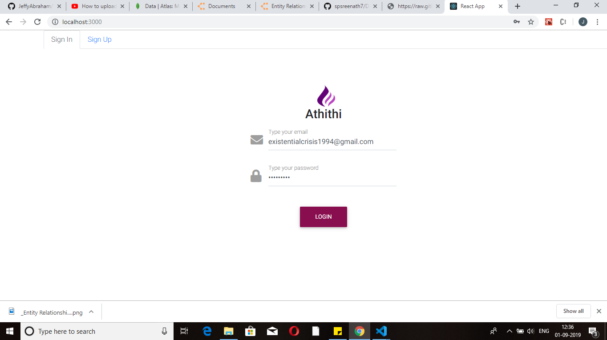
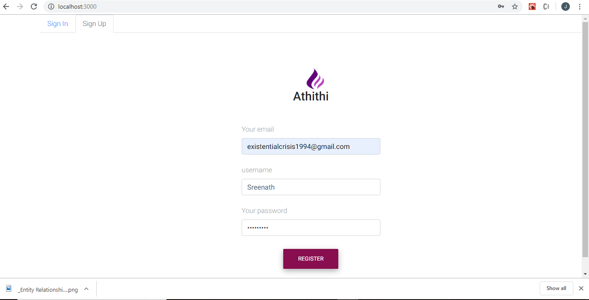
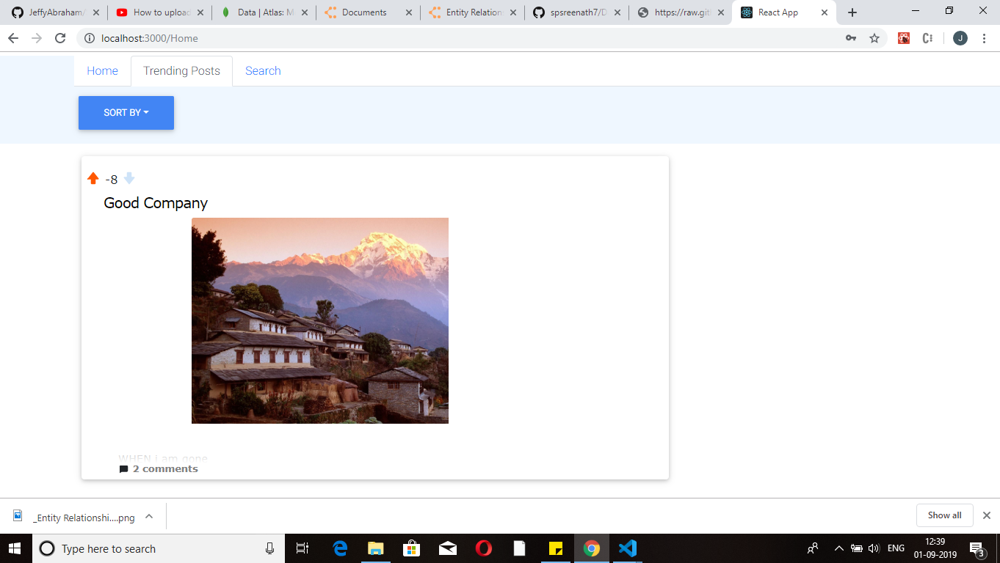
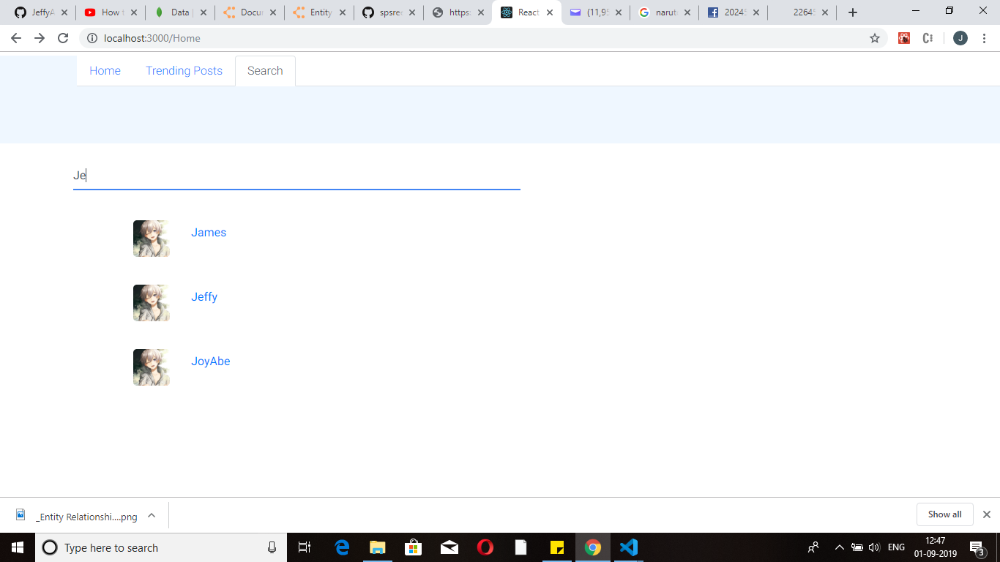
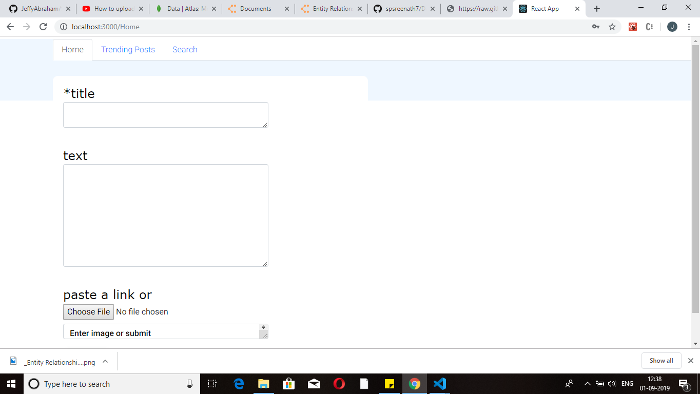
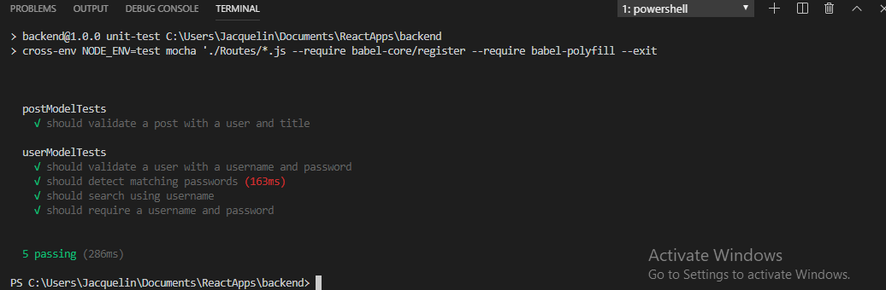
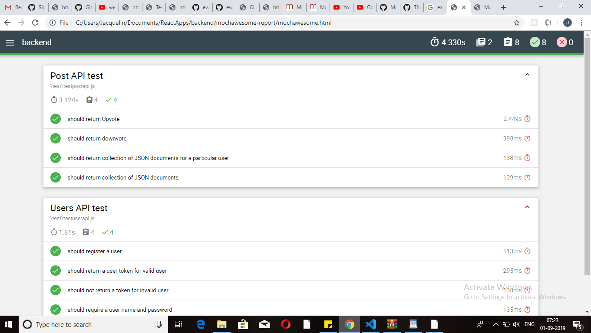

# Assignment 2 - Web application using React, Node and Express.

Name: Jeffy Abraham

# Snapshot "A photo sharing platform"

## Overview.

This web application is a social networking website which allows users to share Images with the world

  List of user features   
 
 + User SignUp/Login
 + Post  image to S3 bucket
 + Allows users to comment on post
 + Allows users to upvote and downvote post
 + Allows users to vote on comments
 + Sort post based on total number of comments and votes
 + Supports multi user interaction
 + Real time search with the help of which users can search for others
 + Shows history of posts posted by users
 + Each user has a Karma  points which increments based on total votes received 
 
## Installation requirements.

Note: All the required node modules are saved in package.json, so no separate installation of modules required. To run the app first start the local JSON server and then start the npm. NPM is started for both client and server separately.

npm start

## Data Model Design.

  
## UI Design.

# Web API Endpoint Reference
Base URL: localhost:3001/
The above service offer API to operate the social networking website .The endpoints allows various functionalities like search for users,get single post,comment on post,upvote post,Upload photos to S3 bucket,Get user profile etc

## API Design

### /User
+ /User/login
    + POST : when the correct email and password is passed it returns a JWT token with help of which user can access protected endpoints
+ /User/Signup
    + POST : New users can Signup with their email id,username and password
+ /User/Single/:userId
    + GET : Can be used to retrieve single user
+ /User/Single/:userId
    + GET : Can be used to retrieve single user    
+ /User/search/:name
    + GET : This  endpoint is used for Mongo text search.It returns a list of record matching the a string
    
### /Post
+ /Post/:userId
    + POST : This route checks if the user is authenticated or not and this endpoint facilitates users to upload picture via multipart form.The uploaded images is then loaded into  Amazon S3 .The link generated after the upload is loaded into mongo db
+ /Post
    + GET : Fetches all the posts with in the data base
+ /Post/single/:PostId
    + GET : retrieves a single post based on the POSTId passed
+ /Post/:userId
    + GET : retrieves all the post of that particular user(endpoint responsible for displaying Users Post History).
+ /Post/Downvote/:PostId 
    + Post : Users can downvote a certain post by -1 
+ /Post/Upvote/:PostId 
    + Post : Users can Upvote a certain post by +1     
    
### /Comments
+ Comments/:PostId
    + GET  : It will retrieve all the comments associated with that particular post
    + POST : This route checks if the user is authenticated or not and this endpoint facilitates users to add comment to the post
+ /Comments/Downvote/:CommentId
    + POST : Downvote a comment
+ /Comments/Upvote/:CommentId
    + POST : Upvotevote a comment
+ /Commnts/Awards/:CommentId/:medal
    + POST : Give gold,Silver or platinum medal to a particular user post
 

## Security and Authentication

In Users API, mongoose schema is enabled with pre configuration to encrypt the password using 'Bcrypt'. 

Using Users API whenever a user signup/login a jwt token is created and sent along with the response body. In order for a user to post Image or comment on an Image he must send the access token along with the request.The access token when sent is verified by JWT.Verify(token).Furthermore a validity peroid  is also set for the token.

The token is stored in localstorage

The endpoints that involves this token based authentication are /Post/userID and /Comment/PostID.

## Testing

Unit testing and Integration testing is done for the individual API end points. 
Unit testing involves test cases that validates the mongoose models. Here each endpoint's corresponding model contains a set of test cases that test the their functionality. .

Integration testing is done by testing each API with a script containing a sequences of tests based API calls. 'Supertest' is used to test individual API calls. For example below script involves sequence of /users endpoint tests, ender each tests a subset of validations are performed to check whether the API works as expected.

## Extra features

+ New user registration and authentication.
+ All user and app data is stored in mongo NoSQL database(Mongodb Atlas) and retrieved using rest API exposed using Node and express middleware.
+ Multi part file upload for uploading photo from front end.
+ Using of multer to retrive file data
+ Amazon S3 used to store images
+ Real time searching using MongoDb text search

## Independent learning.

+Learned aws-sdk for uploading files to S3
+Using multer for retrieving image from front end
+Learned how to use multipart form in react to upload image

